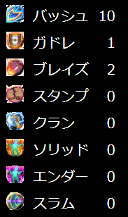

  

## はじめに
FEZ Skill Counterは、FEZのスキル回数を自動的にカウント、保存するためのツールです。  
また、使用を忘れがちな書の使用を、戦争終了近くになると音声で通知する機能もあります。  
  
スキル回数のカウントは、FEZの画面を一定間隔でキャプチャ(スクリーンショットを撮影)し、  
その画像内の情報を解析することで実現しています。  

## Download
[ダウンロード先](https://github.com/saipan-fez/fez_skill_counter/releases)
  
上記リンクの `FEZSkillCounter.zip` からダウンロード可能です。  
**なお、下記の「利用にあたって」「初期設定」は必ず確認してください。**  
  
旧バージョンからアップデートする場合は、上書きコピーで問題ありません。  
※skillcount.dbは各種スコアを保存しているファイルですので、ご注意ください。  
  
不具合、新機能の要望やアイディアがありましたら、[issues](https://github.com/saipan-fez/fez_skill_counter/issues)または[Twitter](https://twitter.com/saipan_fez)にご連絡ください。

## 利用にあたって
**1. ご利用は自己責任でお願いします**  
当ツールの利用により利用者または第三者に生じた損害や不利益トラブルについて、  
作成者はその一切の責任を負いません。

**2. 正確な回数をカウントできません**  
仕組み上、スキルの使用数を正確にカウントできません。  
また、敵にスキルが当たったかどうかではなく、スキルの使用(Powの消費)でカウントされます。  
なお、銃専用スキルについてはカウントされません。

## 初期設定
**下記の設定を必ず行ってください。**  
**設定が異なる場合、ツールが正しく動作しません。**  

**1. ウィンドウ色を「通常」に変更する**
1. クライアントを起動
2. 「OPTION」ボタンを押下
3. 「カラー」タブに移動
4. ウィンドウカラーを「通常」に変更
5. 「閉じる」ボタンを押下

**2. フルスクリーン設定を「OFF」に変更する**
1. クライアントを起動
2. 「OPTION」ボタンを押下
3. 「スクリーンサイズ」タブに移動
4. 「フルスクリーンで表示」をOFFに変更
5. 「閉じる」ボタンを押下

## 機能・使い方
### 1. スキル使用回数のカウント
アプリを起動したままFEZをプレイすると、スキルの使用に応じて自動でカウントされます。  
戦争開始時に回数はリセットされますが、Resetボタンを押下することで手動でリセットすることも可能です。  

### 2. スキル使用回数の履歴表示
Historyタブでは過去の戦争のスキル使用回数を閲覧できます。  
また、職業フィルターを使用することで職を絞ることも可能です。  

### 3. 書の時間 音声お知らせ
戦争終了近く(0.5ゲージ以下)になったとき、書が使用されるまで1分間隔で音声でお知らせしてくれます。  
  
注意  
右下の書のアイコン(矢印アイコン)の表示有無で判断しているため、  
回数書と時間書の判断はできません。  
そのため、回数書を重ねがけしている状態で時間書を利用する場合は通知されません。  

### 4. 設定

|項目名|説明|
|:-----|:---|
|テキスト・HTMLファイルに出力する|`skillcount.txt`・`html/skillcount.xml`に現在のスキル使用回数を出力するかどうか|
|書の時間お知らせ機能を有効にする|書の時間 音声お知らせするかどうか|
|デバッグ機能を有効にする|デバッグ情報の表示・ログを保存するかどうか|

## Tips
### 書の時間お知らせ音声の差し替え
デフォルトではゆっくりボイスになっていますが、好みの音声に差し替え可能です。  
差し替えたい音声ファイルを、実行ファイル内のsoundフォルダにある`book_notify.wav`に上書き保存してください。  
なお、形式はWAVのみ対応しています(MP3などの場合は変換してください)。  

### 配信用テキスト・HTMLファイルの使い方(OBS)

  

上記画像のように配信画面にスキル使用回数を表示することが出来ます。  
方法としてはHTMLファイルを用いる方法と、テキストファイルを用いる方法の二通りあります。  
いずれの場合も設定から`テキスト・HTMLファイルに出力する`をONにしてください。  

#### 方法1：HTMLファイルを使用する
スキルアイコンを表示でき、文字の装飾や整形など細かな調整も可能ですが、
調整にはHTMLを直接編集する必要があります。

設定方法は下記の通りです。

1. ソースの追加から `ブラウザ` を選択
2. `ローカルファイル` にチェックを入れる
3. 参照ボタンを押下し、ファイル選択ダイアログを表示する
4. 実行ファイル内のhtmlフォルダにある`skillcount.html` を選択する

#### 方法2：テキストファイルを使用する
文字色などの変更を容易に行えますが、  
表示に若干のラグがあり、文字の整形等細かな調整が出来ません。  

設定方法は下記の通りです。

1. ソースの追加から `テキスト(GDI+)` を選択
2. `ファイルからの読み取り` にチェックを入れる
3. 参照ボタンを押下し、ファイル選択ダイアログを表示する
4. 実行ファイル内にある `skillcount.txt` を選択する

> `skillcount.txt`は`テキスト・HTMLファイルに出力する`をONにした状態で、
> アプリを使用したときに作成されます。
> ファイルが存在しない場合は、アプリを再起動などしてください。
